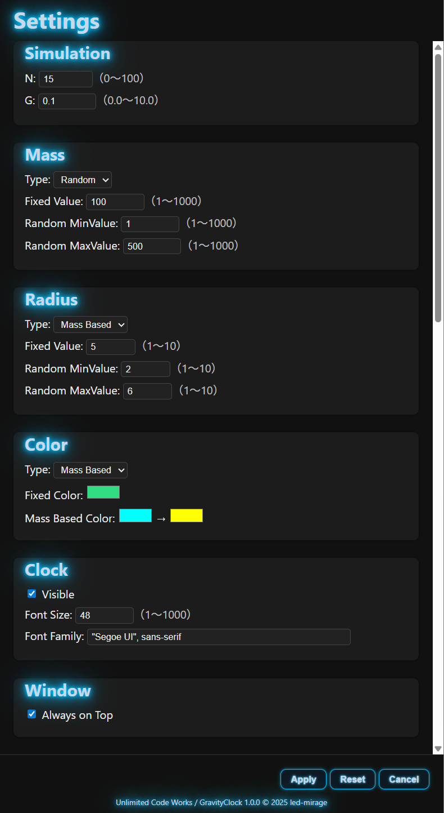

#  GravityClock

**GravityClock** is a beautiful desktop clock application inspired by particles that attract each other through gravity.

Glowing dots drift, gather, and shimmer like stars as time flows at the center.

## 💎 Screenshot

[https://github.com/user-attachments/assets/336b66ff-12ca-4412-acc8-49a112bb9294](https://github.com/user-attachments/assets/336b66ff-12ca-4412-acc8-49a112bb9294)

## 💎 Features

- **N-body Gravity Simulation**

  - Particles attract each other via Newtonian gravity, creating realistic and dynamic motion.

- **Beautiful Light Rendering**

  - Each particle emits soft glowing colors with trailing effects for a dreamy, atmospheric look.

- **Digital Clock Display**

  - A neon-style clock is shown at the center. You can toggle visibility and customize font and size.

- **User-Friendly Window Controls**

  - Drag to move the window, and drag the right or bottom edges to resize.
  - Window position and size are automatically saved.

- **Lightweight Design**

  - Runs smoothly using a native window powered by PyWebView.

## 💎 System Requirements

- OS: Windows 11
- Python: 3.9 – 3.13

## 💎 How to Run

### ① Using the Executable (Easy)

1. Download the latest **`GravityClock.exe`** from the [Releases](https://github.com/led-mirage/GravityClock/releases/) page.
2. Run the file directly — no installation required.

> ⚠️ Some antivirus software may falsely flag the executable.
> See “Antivirus False Positives” below for details.

### ② Running with Python (For Developers)

1. Clone or download this repository.

   ```bash
   git clone https://github.com/led-mirage/GravityClock.git
   cd GravityClock
   ```

2. Install dependencies.

   ```bash
   pip install pywebview==6.1.0
   ```

3. Launch the application.

   ```bash
   python src/main.py
   ```

> 💡 If you want to avoid polluting your global Python environment, it's recommended to use a **virtual environment (venv)**:
>
> ```bash
> python -m venv venv
> .\venv\Scripts\activate  # Windows
> pip install pywebview==6.1.0
> python src/main.py
> ```

## 💎 Settings

You can configure the app through the settings screen.



Details of each setting are as follows:

### 🏷️ Simulation

- **N:** Number of particles (0–100)
- **G:** Gravity strength (0.0–10.0)

### 🏷️ Mass

- **type:** How particle mass is determined

  - **fixed:** Fixed value
  - **random:** Random value
- **fixedValue:** Mass when `type` is `fixed`
- **randomMinValue:** Minimum mass when `type` is `random`
- **randomMaxValue:** Maximum mass when `type` is `random`

### 🏷️ Radius

- **type:** How particle radius is determined

  - **fixed:** Fixed value
  - **random:** Random value
  - **mass_based:** Based on mass
- **fixedValue:** Radius when `type` is `fixed`
- **randomMinValue:** Minimum radius when `type` is `random`
- **randomMaxValue:** Maximum radius when `type` is `random`

### 🏷️ Color

- **type:** How particle color is determined

  - **fixed:** Fixed color
  - **random:** Random color
  - **mass_based:** Based on mass
  - **cycling:** Cycles through 10 preset colors
- **fixedValue:** Color when `type` is `fixed` (`#ffffff` format)
- **massBased0:** Start color for `mass_based`
- **massBased1:** End color for `mass_based`

### 🏷️ Clock

- **visible:** Toggle clock visibility
- **fontSize:** Clock font size (px)
- **fontFamily:** Clock font family

### 🏷️ Window

- **onTop:** Keep the window always on top

## 💎 Controls

| Action                                   | Description                      |
| ---------------------------------------- | -------------------------------- |
| Drag                                     | Move window                      |
| Drag right/bottom                        | Resize window                    |
| Double-click                             | Maximize / restore               |
| `Esc`                                    | Restore from maximized           |
| `Ctrl + M`                               | Minimize                         |
| `R`                                      | Reset particle positions         |
| Move the mouse near the top-left corner  | The settings button (⚙️) appears |
| Move the mouse near the top-right corner | The close button (×) appears     |

## 💎 Notes

### Antivirus False Positives

The executable (**GravityClock.exe**) is built using PyInstaller.  
Some antivirus programs may mistakenly detect it as malware.

There is **no malicious code** in this application,  
but if you're concerned, you can run it using the “Run with Python” steps above.

We continue to work on reducing false positives, but the issue is not fully resolved yet.  
Thank you for your understanding.

You can check the VirusTotal scan results here.  
(As of 2025/xx/xx: 4/72 detections)

## 💎 Libraries Used

### 🔖 pywebview 6.1.0

Homepage: [https://github.com/r0x0r/pywebview](https://github.com/r0x0r/pywebview)  
License: BSD-3-Clause

### 🔖 pyinstaller-versionfile 3.0.1

Homepage: [https://github.com/DudeNr33/pyinstaller-versionfile](https://github.com/DudeNr33/pyinstaller-versionfile)  
License: MIT

### 🔖 PyInstaller 6.16.0

Homepage: [https://github.com/pyinstaller/pyinstaller](https://github.com/pyinstaller/pyinstaller)  
License: GPL 2.0 / Apache 2.0

## 💎 License

This application is released under the [MIT License](https://opensource.org/licenses/MIT).  
Please see the **LICENSE** file for details.

© 2025 led-mirage

## 💎 Version History

### 1.0.0 (2025/xx/xx)

- Initial release
